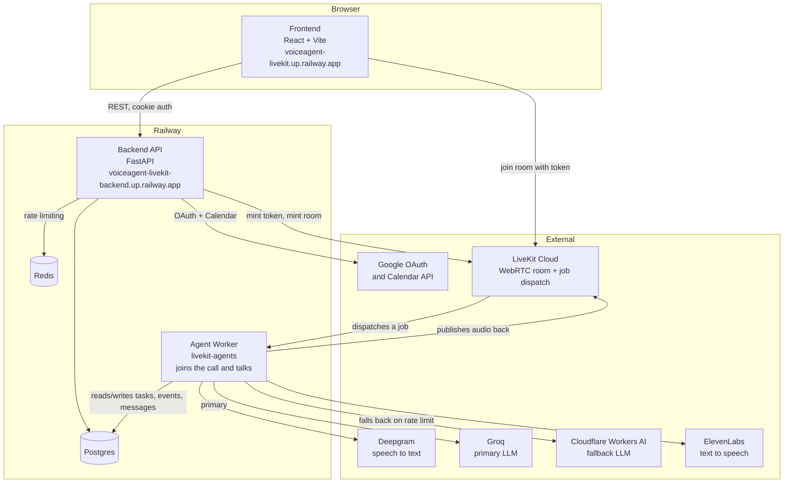
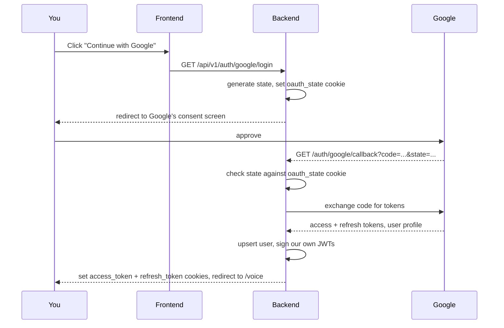
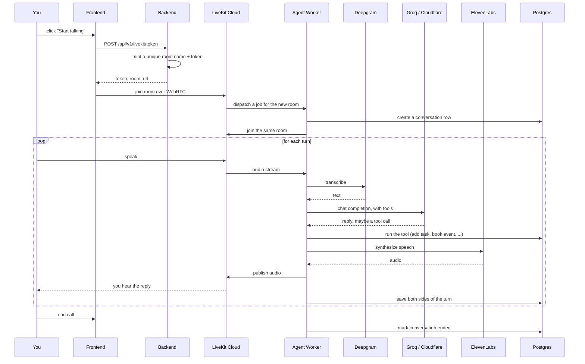
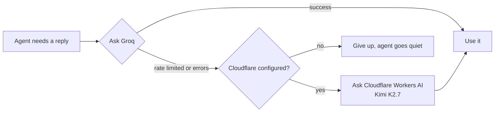
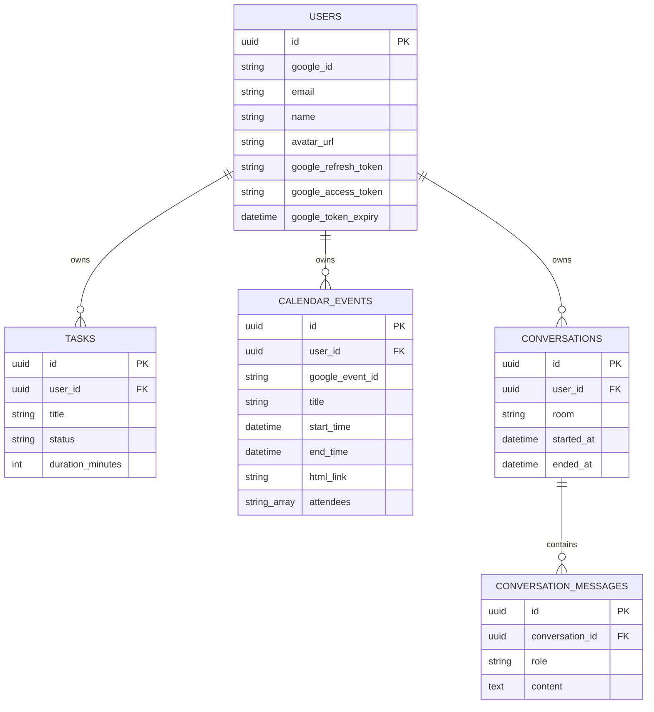

# Voice Agent

A voice assistant you actually talk to. Sign in with Google, hit "Start talking," and ask it to manage your to-do list, book a calendar event, or tell you what your day looks like. Everything happens over a live voice call, powered by LiveKit, and every conversation gets saved so you can revisit or continue it later.

This repo holds three pieces that work together: a FastAPI backend, a React frontend, and a separate voice agent worker process that actually joins the call and talks to you.

## What it can do

- **Tasks.** Add, complete, or delete tasks by voice, each with an estimated duration and a status (not started, in progress, completed).
- **Calendar.** Book Google Calendar events, invite people, check what is on your schedule for a given day, and it will politely refuse to double book you.
- **Conversations.** Every call is transcribed and saved. You can read back through old conversations from the sidebar, or pick up where you left off.
- **Google sign-in.** No separate account system. You sign in with Google and that is it.

## How it is put together



The frontend never talks to the voice pipeline directly. It asks the backend for a LiveKit token, then joins the room itself over WebRTC. LiveKit sees a new room appear and dispatches a job to whichever worker process is registered and free, and that worker is the thing that actually listens to you, thinks, and talks back.

The backend and the worker are separate deployments on purpose. The backend is a normal request/response API. The worker is a long running process that holds a live audio connection open for the length of a call, so it needs its own lifecycle and its own scaling story.

## Signing in



The app issues its own short lived access token and a longer lived refresh token, both as httponly cookies. The access token expires in an hour; the frontend calls `/api/v1/auth/refresh` automatically when a request comes back 401. If the refresh token is also gone or expired, you get bounced back to the login screen.

One thing worth knowing if you are deploying this yourself: the frontend and backend usually live on different subdomains, so `COOKIE_SECURE` needs to be `true` in any real deployment. Without it the cookies get set as `SameSite=Lax`, which browsers will not send on cross-site API calls, and you will see mysterious 401s on `/auth/me` even though login appeared to succeed.

## What happens during a call



Every room gets a name like `assistant-{user_id}-{a fresh uuid}`. That "fresh uuid" part matters more than it looks. LiveKit only auto-dispatches a worker when a room is newly created, not when someone rejoins one that technically still exists. Early on this app reused the same room name per user, and when the previous call's agent process was still lingering during its shutdown (which can take close to a minute), starting a new conversation right away would silently join that stale room and never get a fresh agent. Giving every conversation its own room name sidesteps the whole problem.

## The LLM has a backup



Groq's free tier has a fairly tight token budget, and a single voice conversation burns through more tokens than you would think once you count the system prompt and every tool's schema on every single turn. If `CLOUDFLARE_ACCOUNT_ID` and `CLOUDFLARE_API_KEY` are set, the worker wraps both providers in LiveKit's `FallbackAdapter`, so a rate limited Groq call quietly retries against Cloudflare's OpenAI-compatible endpoint instead of leaving you talking to dead air. Both are optional to set up, but if you skip Cloudflare, a busy Groq account just means the agent stops responding until the quota resets.

## What the agent can actually do

These are the tools wired into the agent's system prompt, defined in `backend/app/agent/tools.py`:

| Tool | What it does |
|---|---|
| `list_tasks` | Reads back your tasks with status and duration |
| `create_task` | Adds a task, and the agent is instructed to ask for a duration rather than guess one |
| `complete_task` | Marks a task done, matched by a fuzzy title search since spoken titles rarely transcribe perfectly |
| `delete_task` | Deletes a task, same fuzzy matching |
| `book_calendar_event` | Books a Google Calendar event, checks for near-duplicate titles and overlapping times first so you cannot double book by accident |
| `add_event_attendees` | Invites more people to an event that is already booked |
| `list_schedule` | Reads back everything on your calendar for a given day |

## Data model



## Project layout

```
backend/
  app/
    agent/          the voice agent: worker entrypoint, system prompt, tools
    api/v1/          FastAPI routers: auth, tasks, calendar, conversations, livekit
    core/            config, database session, security, rate limiting
    models/          SQLAlchemy models
    repositories/    one repository per model, all the actual queries live here
    schemas/         Pydantic request/response shapes
    services/        Google Calendar and LiveKit token minting
  alembic/           migrations
  Dockerfile         builds the backend API image
  docker-compose.yml local Postgres + pgAdmin + Redis for development

frontend/
  src/
    pages/           one file per route
    components/      shared UI, including shadcn-based components/ui
    stores/          Zustand stores (auth, voice call state, tasks)
    lib/             API client, LiveKit helpers, small utilities
```

## Running it locally

You need Python 3.13, Node with pnpm, and Docker for the local Postgres/Redis.

**1. Start Postgres and Redis**

```bash
cd backend
docker-compose up -d
```

**2. Backend**

```bash
cd backend
cp .env.example .env
# fill in .env, see the reference below
uv sync
uv run alembic upgrade head
uv run uvicorn app.main:app --reload
```

**3. The voice agent worker**

This is a separate long-running process from the API server, so it needs its own terminal:

```bash
cd backend
uv run python -m app.agent.worker dev
```

Do not run more than one of these against the same LiveKit project at once, even across a local machine and a deployed environment. LiveKit will register both and split job dispatch between them, so calls will intermittently connect to whichever worker happens to be free, which is a confusing thing to debug if you are not expecting it.

**4. Frontend**

```bash
cd frontend
cp .env.example .env
pnpm install
pnpm dev
```

The frontend runs at `http://localhost:5173`, the backend at `http://localhost:8000`.

## Environment variables

### Backend

| Variable | What it is |
|---|---|
| `DATABASE_URL` | Full Postgres connection string. Leave unset to use the discrete `POSTGRES_*` vars instead, which is what local dev does |
| `POSTGRES_USER`, `POSTGRES_PASSWORD`, `POSTGRES_SERVER`, `POSTGRES_PORT`, `POSTGRES_DB` | Used when `DATABASE_URL` is not set |
| `REDIS_URL` | Used for rate limiting |
| `GOOGLE_CLIENT_ID`, `GOOGLE_CLIENT_SECRET`, `GOOGLE_REDIRECT_URI` | From a Google Cloud OAuth client. The redirect URI has to exactly match what is registered in Google Cloud Console |
| `JWT_SECRET` | Signs the app's own access and refresh tokens. Generate with `python -c "import secrets; print(secrets.token_urlsafe(48))"` |
| `JWT_EXPIRY_MINUTES` | Access token lifetime, defaults to 60 |
| `REFRESH_TOKEN_EXPIRY_DAYS` | Refresh token lifetime, defaults to 7 |
| `REFRESH_TOKEN_ENCRYPTION_KEY` | A Fernet key. Generate with `python -c "from cryptography.fernet import Fernet; print(Fernet.generate_key().decode())"` |
| `FRONTEND_URL` | Where the OAuth callback redirects to after login |
| `ALLOWED_ORIGINS` | A JSON array of allowed CORS origins, for example `["https://your-frontend.example.com"]`. If your production frontend's exact origin is not in here, every API call from it will fail with a CORS error even though the request technically reaches the server |
| `COOKIE_SECURE` | Set to `true` for any deployment where the frontend and backend are on different domains, see the login section above |
| `LIVEKIT_URL`, `LIVEKIT_API_KEY`, `LIVEKIT_API_SECRET` | From your LiveKit Cloud project. These three must be identical between the backend service and the worker service, since the backend mints tokens locally without ever contacting LiveKit, so a mismatched key pair fails silently instead of throwing an error |
| `DEEPGRAM_API_KEY` | Speech to text |
| `LLM_API_KEY`, `LLM_BASE_URL`, `LLM_MODEL` | The primary LLM. Defaults to Groq's OpenAI-compatible endpoint running `llama-3.3-70b-versatile` |
| `CLOUDFLARE_ACCOUNT_ID`, `CLOUDFLARE_API_KEY`, `FALLBACK_LLM_MODEL` | Optional fallback LLM through Cloudflare Workers AI, see above |
| `ELEVENLABS_API_KEY`, `ELEVENLABS_VOICE_ID` | Text to speech. Voice ID is optional, falls back to ElevenLabs' default voice |

### Frontend

| Variable | What it is |
|---|---|
| `VITE_API_URL` | Base URL of the backend, for example `http://localhost:8000` locally |

## Deploying

This runs as three separate services plus two managed datastores, which on Railway looks like: a backend web service running the Dockerfile's default command, a worker service running `python -m app.agent.worker start` as a custom start command, a static frontend service built from `pnpm build`, and Railway's managed Postgres and Redis plugins.

A few things that are easy to get wrong the first time:

- The worker service needs its own copy of every `LIVEKIT_*` and `CLOUDFLARE_*` variable. It does not read the backend's environment.
- `ALLOWED_ORIGINS` on the backend has to contain the frontend's actual deployed origin, not `localhost`.
- `COOKIE_SECURE` has to be `true` once frontend and backend are on different domains.
- Only ever run one worker per LiveKit project. If you spin up a second one while testing (a local `dev` worker alongside the deployed one, for instance) they will compete for job dispatch and calls will randomly fail depending on which one gets picked.

## A note on the tests

Backend tests live in `backend/tests` and run with `uv run pytest`. Linting is `uv run ruff check` and `uv run ruff format`, type checking is `uv run mypy app`. The frontend lints with `pnpm lint` (oxlint) and type checks with `pnpm build`, since `tsc -b` runs before the Vite build.
